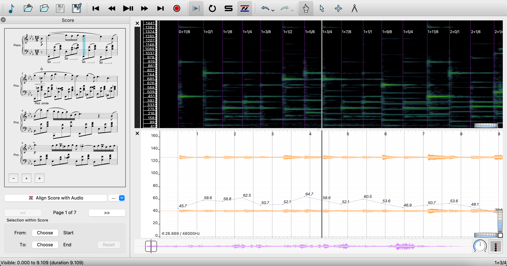

*Piano Precision*
================

### A software tool that assists analyzing recorded piano performances together with their scores.

This software is adapted from [Sonic Visualiser](https://github.com/sonic-visualiser/sonic-visualiser), but with an added panel displaying musical scores, and additional features such as audio-to-score alignment. Its interface is designed to help streamline the processes of loading a digital score and a performance recording, editing and visualizing annotations, and exporting score-aware annotations.

*Piano Precision* needs to be used together with Vamp aligner plugins that can conduct audio-to-score alignment. Existing releases already include a default plugin, [piano aligner](https://github.com/yucongj/SV_PianoAligner). For anyone who would like to develop new aligner plugins for *Piano Precision*, please refer to the later section [Developing Vamp aligner plugins](#developing-vamp-aligner-plugins).

## How to use *Piano Precision*

### Loading a score
Go to the File menu and select Choose Score (or select the musical note icon at the upper left corner). The score file format must be [MEI] (https://music-encoding.org).

### Loading a recording
Go to the File menu and select Open Recording (or select the second icon from the upper left corner).

### Aligning score with audio
Click on the "Align Score with Audio" button underneath the rendered score. This will trigger the selected aligner plugin to conduct audio-to-score alignment. The estimated onsets will be displayed in the same pane as the spectrogram. Choose "Accept Alignment" if you think the result is an acceptable starting point for further manual refinements (see [Correcting alignments] (#correcting-alignments)); otherwise, choose "Reject Alignment" and consider conducting alignments section by section via [partial alignments] (#partial-alignments).

### Correcting alignments

If estimated onsets are misaligned with the actual performance, you can correct them easily by dragging the onset indicators. Make sure you are in the Editing mode when doing so; you may switch between the Navigation mode (default) and the Editing mode by toggling between the number keys "1" and "3".

Some helpful features:

* Automatically highlighted notes in the score and text labels representing the position of selected notes
* As the onsets are edited, the tempo curve is updated in real time. 
* Toggle on onset clipping sound (default on).
* The slowdown feature (the speed dial at the lower right corner).

### Exporting and importing alignments
To export alignments, go to the File menu and choose Save Score Alignment As (or select the fifth icon from the left). The first column in the saved CSV file contains score times and the second column contains onset timestamps in seconds. A score time is represented by a text label specifying the measure number and the position within the measure. For
example, the label “1+0/1” stands for the beginning of the first measure, and the label “1+3/4” stands for after three quarter notes worth of time in the first measure.

To import alignments, go to the File menu and choose Load Score Alignment (or select the third icon from the left). The imported CSV file needs to have two columns containing score times and onset times.

### Partial alignments

To align only one section of the score, select a region in the score and select the corresponding region in the recording before requesting alignments. You may select a score region via the two Choose buttons beneath the rendered score. To select a recording region, first switch to the Select mode by pressing the number key "2", and then use your cursor to paint a region in the recording area (you may press the Escape key to cancel a selection).

The partial alignment feature is especially useful when the whole recording of a score is not available, or when one is interested in analyzing only a particular section. Exported alignment files from partial alignments still contain all the score labels, and the ones outside of aligned regions would have "NA'' as their onset times.

### Limitations

* Grace notes are currently omitted.
* The software currently supports annotations only about timing (note onsets and tempo).

## Developing Vamp aligner plugins

